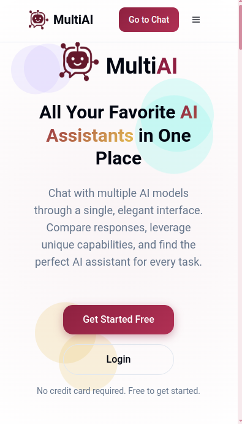
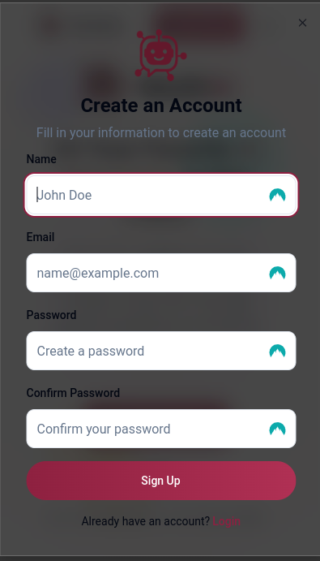

# MultiAI Chat Platform


A premium web application template for creating sophisticated multi-AI chatbot interfaces. MultiAI seamlessly integrates various AI services (ChatGPT, Claude, DeepSeek, etc.) through an elegant, unified interface featuring a distinctive wine-inspired design system.

## ✨ Features

### Unified AI Experience
- **Multiple AI Integration** - Connect to various AI models through a single interface
- **Conversation Management** - Save, organize, and revisit past conversations
- **Full Markdown Support** - Render code blocks, tables, and equations with ease

### Modern UI Elements
- **Wine-Inspired Color Palette** - Elegant wine red primary colors with complementary accents
- **Light & Dark Themes** - Fully implemented theme switching with smooth transitions
- **Glass Morphism** - Beautiful blur effects and transparent elements
- **Shimmer Loading States** - Replace traditional spinners with elegant shimmer animations
- **Microinteractions** - Subtle, delightful animations throughout the interface

### Complete User Journey
- **Marketing Landing Page** - Compelling entry point for new users
- **Authentication Flow** - Full signup/login functionality
- **Chat Interface** - Intuitive messaging experience
- **User Settings** - Customizable preferences and profile management

### Developer-Friendly
- **Clean, Modular Code** - Well-structured components for easy customization
- **Responsive Design** - Mobile-first approach with breakpoints for all devices
- **Mock Data Integration** - Ready-to-use simulated conversations and responses
- **LocalStorage Implementation** - Store user data client-side for demonstration
- **Detailed Documentation** - Comprehensive guide for customization

## 🖼️ Screenshots

<div style="display: flex; flex-wrap: wrap; gap: 10px; justify-content: center;">
  
  
  
  
</div>

## 🚀 Getting Started

### Prerequisites
- Node.js (v16+)
- npm or yarn

### Installation

1. Clone this repository
```bash
git clone https://github.com/jamesadewara/multi-ai.git
cd multi-ai
```

2. Install dependencies
```bash
npm install
# or
yarn install
```

3. Start the development server
```bash
npm run dev
# or
yarn dev
```

4. Open your browser and navigate to `http://localhost:3000`

## 🛠️ Customization

### Connecting Real AI Services
The template comes with mock AI responses, but can be easily connected to real AI services:

1. Navigate to `src/contexts/`
2. Replace mock implementations with actual API calls

### Changing the Theme
To modify the color scheme:

1. Open `src/index.css`
2. Adjust the primary, secondary, and accent colors
3. All component styling will update automatically

### Adding New AI Providers
To add support for additional AI services:

1. Create a new provider in `src/contexts/chat-context.tsx`
2. Implement the standard provider interface

## 💼 License & Usage

This template is available for:

- Personal use
- Commercial projects
- Client work

You may not:
- Resell or redistribute this template
- Include this template in other template collections# multi-ai
